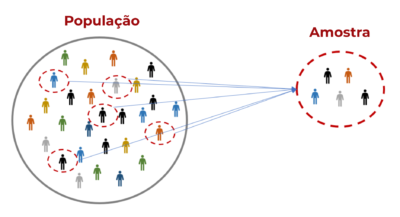
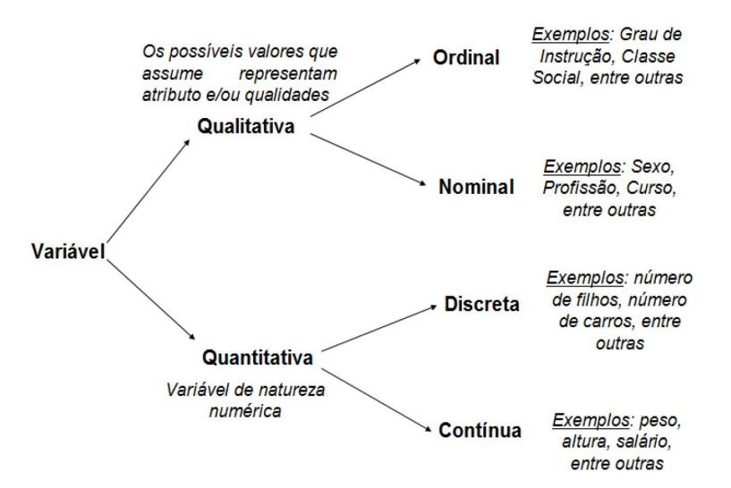

# Estatística Descritiva {#cap-descritiva}

A Estatística Descritiva é a área da estatística que visa **organizar, resumir e descrever** um conjunto de dados. Neste capítulo, apresentaremos os conceitos fundamentais para a análise exploratória de dados, incluindo medidas de posição e dispersão, distribuições de frequências, representações gráficas e técnicas de amostragem.

Ao longo de todo o capítulo, utilizaremos um conjunto de dados fictício de uma pesquisa com 50 observações. Vamos carregá-lo:

```{r}
#| echo: true
#| eval: false
dados <- read.csv("dados/pesquisa_exemplo.csv")
str(dados)
head(dados)
```

O conjunto contém as variáveis: `id`, `idade`, `renda`, `escolaridade`, `regiao`, `genero`, `satisfacao`, `horas_estudo` e `nota_final`.

## O que é Estatística {#sec-o-que-e}

### Definição {#sec-definicao}

Algumas definições para a Estatística:

> Estatística é a ciência que utiliza as teorias probabilísticas para explicar a frequência da ocorrência de eventos, tanto em estudos observacionais quanto em experimentos para modelar a aleatoriedade e a incerteza de forma a estimar ou possibilitar a previsão de fenômenos futuros, conforme o caso. (Saulo Henrique Weber, 2006)

> A Estatística é a ciência que coleta, organiza, analisa, interpreta e apresenta dados. Ela fornece ferramentas e métodos para transformar informações brutas em conhecimento útil, permitindo a tomada de decisões embasadas em evidências. (D.S. Moore, et al., 1999)

> Até que um fenômeno de qualquer ramo do conhecimento seja submetido a medidas e números, este não assumirá um status e seriedade na Ciência. --- Popularmente atribuída a Francis Galton

> Estatística é a arte de aprender a partir de dados. (Ross, 2010)

> Sem dados você é uma pessoa qualquer com uma opinião. --- William Edwards Deming

> Estatística é a gramática da Ciência. --- Karl Pearson

### Breve História da Estatística {#sec-historia}

A palavra "Estatística" tem origem no latim *status*, que significa "estado". Nos séculos XVII e XVIII, os governos europeus começaram a coletar dados sobre suas populações --- nascimentos, mortes, impostos --- para fins administrativos. Esse uso inicial deu à disciplina o seu nome.

Com o passar do tempo, a Estatística evoluiu de uma ferramenta puramente descritiva para uma ciência rigorosa. No século XIX, pensadores como **Francis Galton** e **Karl Pearson** desenvolveram conceitos como regressão e correlação. No século XX, **Ronald Fisher** revolucionou a área ao formalizar os testes de hipóteses e a análise de variância, lançando as bases da inferência estatística moderna.

Hoje, a Estatística está na base da ciência de dados, do aprendizado de máquina e de praticamente toda pesquisa científica quantitativa.

Algumas leituras recomendadas são *O Andar do Bêbado* (Leonard Mlodinow) e *Uma Senhora Toma Chá* (David Salsburg) para aprendizado sobre a evolução histórica da estatística e probabilidade e para desenvolver intuição sobre conceitos complexos.

### Importância e Aplicações {#sec-importancia}

A Estatística é fundamental para muitas áreas e aplicável em quase todas porque permite testar hipóteses, validar teorias e generalizar resultados a partir de dados --- e hoje em dia se coletam dados de quase tudo. Algumas dessas áreas são administração do Estado, otimização de processos industriais e de engenharia, computação, ciências (saúde, biológicas, sociais, física).

Ela nos permite responder questões como:

- Qual tipo e quantidade de dados devo coletar?
- Como organizar e resumir estes dados?
- Como analisar os dados e fazer conclusões a partir deles?
- Como avaliar a força destas conclusões e avaliar sua incerteza?
- Como planejar um experimento que verifique a minha hipótese?

Algumas aplicações específicas são:

- Identificar mensagens indesejáveis em um e-mail (spam);
- Segmentação do comportamento de consumidores para propagandas direcionadas;
- Redução de fraudes em transações de cartão de crédito;
- Predição de eleições;
- Otimização do uso de energia em edifícios;
- Existe relação entre desemprego e procura por Uber?
- Os desembolsos do BNDES fizeram aumentar a taxa de investimento da economia brasileira?
- Como explicar a inflação de alimentos?
- O Banco Central brasileiro reage aos choques cambiais?
- Qual o efeito do aumento da volatilidade no mercado sobre a taxa de câmbio?

## Divisão do Livro {#sec-divisao}

Tradicionalmente se divide didaticamente a estatística nas seguintes partes (o que a ementa dessa disciplina faz e consequentemente este livro também):

- **Estatística Descritiva**: É a área da estatística que visa organizar, resumir e descrever um conjunto de dados.
- **Teoria da Probabilidade**: Base teórica da estatística, é um ramo da matemática que estuda fenômenos aleatórios, ou seja, eventos cujos resultados não são determinísticos, mas sim sujeitos a incertezas. Ela fornece uma estrutura formal para quantificar a incerteza e modelar situações onde o acaso está presente.
- **Estatística Inferencial**: Coleção de métodos e técnicas utilizados para estudar uma população baseado em amostras probabilísticas desta população. É uma ferramenta valiosa para tomar decisões e fazer previsões.

Também haverá seções em cada capítulo onde a aplicação dos conceitos citados será feita nos softwares estatísticos R, Python e aplicativos de planilhas (no caso o Google Sheets, mas o mesmo pode ser aplicado no LibreOffice Calc ou no clássico Excel).

## Conceitos Básicos {#sec-conceitos}

### População {#sec-populacao}

::: {.callout-note title="Definição"}
**População** é o conjunto de **todos** os elementos com a característica de interesse, sobre a qual desejamos obter informações. A população pode ser finita ou infinita. Representamos por $N$ o número de elementos da população.
:::

Exemplos:

- Todos os pacientes com diabetes no Brasil em um determinado ano.
- Todas as árvores de uma floresta tropical.
- Todos os carros de um modelo específico em uma concessionária.
- Todos os acessos a um site em 24 horas.

### Amostra {#sec-amostra}

::: {.callout-note title="Definição"}
**Amostra** é um subconjunto retirado de uma população, obtido através de técnicas de amostragem. O número de elementos da amostra é representado por $n$.
:::

**Exemplo:** Em uma pesquisa eleitoral para saber o resultado das eleições para presidente do Brasil, qual a população de interesse? Qual seria a amostra?

**Resposta:** A população é constituída de todos os eleitores do Brasil. A amostra seria um subconjunto (ex.: $n = 2000$ eleitores) da população.



### Censo {#sec-censo}

::: {.callout-note title="Definição"}
**Censo** é o processo utilizado para levantar as características observáveis abordando **todos** os elementos de uma população. Um levantamento efetuado sobre toda uma população é denominado levantamento censitário ou simplesmente censo.
:::

O exemplo mais conhecido no Brasil é o **Censo Demográfico** realizado pelo IBGE. O Censo de 2022 visitou todos os domicílios do país, coletando informações sobre população, habitação, educação, renda e outras características socioeconômicas. Mais informações em: <https://www.ibge.gov.br/estatisticas/sociais/trabalho/22827-censo-demografico-2022.html>

### Parâmetros {#sec-parametros}

::: {.callout-note title="Definição"}
**Parâmetro** é uma medida fixa (geralmente desconhecida) que descreve uma característica de uma **população** inteira. Como se refere a toda a população, seu valor não muda (a menos que a população seja alterada).
:::

Exemplos: Média populacional ($\mu$), desvio padrão populacional ($\sigma$), proporção populacional ($p$).

### Estatísticas {#sec-estatisticas}

::: {.callout-note title="Definição"}
**Estatística** (no sentido de medida) é uma medida descritiva calculada a partir de uma **amostra** (um subconjunto de uma população). Como a amostra é apenas uma parte da população, a estatística pode variar de amostra para amostra (variabilidade amostral).
:::

Exemplos: Média amostral ($\bar{x}$), desvio padrão amostral ($s$), proporção amostral ($\hat{p}$).

### Variável {#sec-variavel}

::: {.callout-note title="Definição"}
**Variável** é qualquer característica que varia de um elemento da população para outro. É a característica que está sendo analisada em cada elemento de uma população.
:::

**Exemplo:** Na população "funcionários de uma determinada empresa", podemos estudar as variáveis: número de dependentes, remuneração financeira, idade, sexo, local de residência, nível de escolaridade, estado civil, tempo de serviço na empresa, etc.

### Conjuntos de Dados {#sec-conjuntos}

Os dados podem ser estruturados de diversas maneiras em diversas extensões e é nosso dever como analista de dados garantir que eles sejam importados da melhor forma para trabalharmos em cima deles.

Para fins práticos trabalharemos com dados no formato de planilha, que é o mais simples e efetivo. Porém, é possível trabalhar com *data warehouses*, bancos de dados relacionais (uma forma estruturada para reduzir redundância de dados e relacionar várias tabelas), bancos de dados não-relacionais, entre outros.

Dados em formato de planilha utilizam apenas uma tabela onde as **linhas** representam os registros, instâncias ou elementos daquela amostra ou população e as **colunas** representam as variáveis. Nosso conjunto de dados de exemplo segue exatamente esse formato:

```{r}
#| echo: true
#| eval: false
# Visualizar as primeiras linhas do conjunto de dados
head(dados)
```

## Classificação das Variáveis {#sec-classificacao}

As variáveis podem ser classificadas em dois grandes grupos: **qualitativas** (categóricas) e **quantitativas** (numéricas). Cada grupo possui subdivisões importantes:

- **Variáveis Qualitativas (Categóricas):**
  - *Nominal:* Não possuem ordenação natural. Ex.: gênero, região, cor dos olhos.
  - *Ordinal:* Possuem uma ordenação natural. Ex.: escolaridade (Fundamental < Médio < Superior), satisfação (Insatisfeito < Neutro < Satisfeito).

- **Variáveis Quantitativas (Numéricas):**
  - *Discreta:* Assumem valores inteiros, geralmente resultantes de contagens. Ex.: número de filhos, número de defeitos.
  - *Contínua:* Assumem qualquer valor dentro de um intervalo, geralmente resultantes de medições. Ex.: altura, peso, renda, temperatura.



No nosso conjunto de dados:

| Variável | Tipo | Subtipo |
|----------|------|---------|
| `id` | Quantitativa | Discreta (identificador) |
| `idade` | Quantitativa | Discreta |
| `renda` | Quantitativa | Contínua |
| `escolaridade` | Qualitativa | Ordinal |
| `regiao` | Qualitativa | Nominal |
| `genero` | Qualitativa | Nominal |
| `satisfacao` | Qualitativa | Ordinal |
| `horas_estudo` | Quantitativa | Contínua |
| `nota_final` | Quantitativa | Contínua |

: Classificação das variáveis do conjunto de dados {#tbl-classificacao}

::: {.callout-tip title="Exercício de Fixação"}
1. Classifique as seguintes variáveis: temperatura corporal, estado civil, número de irmãos, CEP, nota em uma prova (0 a 10), tipo sanguíneo.
2. No conjunto de dados `pesquisa_exemplo.csv`, identifique quais variáveis são qualitativas nominais, qualitativas ordinais, quantitativas discretas e quantitativas contínuas.
:::

## Distribuição de Frequências {#sec-frequencias}

A distribuição de frequências é uma forma de organizar e resumir dados, mostrando como os valores de uma variável estão distribuídos. Ela pode ser aplicada tanto para variáveis quantitativas (numéricas) quanto para variáveis qualitativas (categóricas).

### Distribuição para Variáveis Qualitativas {#sec-freq-quali}

A distribuição de frequências para variáveis qualitativas é feita contando a ocorrência de cada categoria.

**Passos:**

1. Listar as categorias presentes na variável.
2. Contar a **frequência absoluta** ($f_i$): número de vezes que cada categoria aparece.
3. Calcular a **frequência relativa** ($fr_i$): proporção de cada categoria em relação ao total.

$$
fr_i = \frac{f_i}{n}
$$

onde $n$ é o número total de observações.

4. Calcular a **frequência relativa percentual**: $fr_i \times 100\%$.

**Exemplo com R:**

```{r}
#| echo: true
#| eval: false
# Frequência absoluta da variável 'regiao'
freq_abs <- table(dados$regiao)
freq_abs

# Frequência relativa
freq_rel <- prop.table(freq_abs)
freq_rel

# Tabela completa de frequências
tabela_freq <- data.frame(
  Regiao = names(freq_abs),
  Frequencia_Absoluta = as.numeric(freq_abs),
  Frequencia_Relativa = round(as.numeric(freq_rel), 4),
  Percentual = round(as.numeric(freq_rel) * 100, 2)
)
tabela_freq
```

```{r}
#| echo: true
#| eval: false
# Frequência absoluta da variável 'satisfacao'
table(dados$satisfacao)

# Frequência relativa percentual
round(prop.table(table(dados$satisfacao)) * 100, 1)
```

::: {.callout-tip title="Exercício de Fixação"}
1. Construa a distribuição de frequências (absoluta e relativa) para a variável `genero` do conjunto de dados.
2. Construa a distribuição de frequências para a variável `escolaridade`. Qual nível de escolaridade é mais frequente?
:::

### Distribuição para Variáveis Quantitativas {#sec-freq-quant}

A distribuição de frequências para variáveis quantitativas é feita agrupando os dados em **intervalos de classe** ou listando cada valor individualmente.

**Passos para construir a distribuição:**

1. **Definir os intervalos de classe** (para dados contínuos):
   - Divida os dados em intervalos (ex.: 0--10, 10--20, 20--30).
   - Cada intervalo é chamado de **classe**.
   - O tamanho do intervalo é chamado de **amplitude de classe** ($h$).

2. **Contar a frequência**: quantos valores estão em cada intervalo (frequência absoluta).

3. **Calcular frequências relativas e acumuladas**:
   - **Frequência relativa** ($fr_i$): proporção de valores em cada classe em relação ao total.
   - **Frequência acumulada** ($F_i$): soma das frequências até uma determinada classe.

**Formas de definir o número de classes ($k$):**

- **Regra de Sturges:** $k = 1 + 3{,}322 \cdot \log_{10}(n)$
- **Regra da raiz quadrada:** $k = \sqrt{n}$

A amplitude de cada classe é então:

$$
h = \frac{x_{\max} - x_{\min}}{k}
$$

**Exemplo com R:**

```{r}
#| echo: true
#| eval: false
# Número de classes pela Regra de Sturges
n <- nrow(dados)
k <- ceiling(1 + 3.322 * log10(n))
k

# Amplitude da classe para a variável 'idade'
amplitude <- (max(dados$idade) - min(dados$idade)) / k
amplitude

# Construir a distribuição de frequências
breaks <- seq(min(dados$idade), max(dados$idade) + amplitude, by = ceiling(amplitude))
classes <- cut(dados$idade, breaks = breaks, right = FALSE)
freq_abs <- table(classes)

# Tabela completa
tabela <- data.frame(
  Classe = names(freq_abs),
  fi = as.numeric(freq_abs),
  fri = round(as.numeric(freq_abs) / n, 4),
  Fi = cumsum(as.numeric(freq_abs)),
  Fri = round(cumsum(as.numeric(freq_abs)) / n, 4)
)
names(tabela) <- c("Classe", "f_i", "fr_i", "F_i", "Fr_i")
tabela
```

::: {.callout-tip title="Exercício de Fixação"}
1. Construa a distribuição de frequências para a variável `renda` utilizando a Regra de Sturges. Interprete os resultados.
2. Construa a distribuição de frequências para a variável `nota_final` com 5 classes de igual amplitude. Qual classe concentra mais observações?
3. Calcule a frequência acumulada relativa para a variável `horas_estudo`. Qual porcentagem dos indivíduos estuda até 10 horas?
:::

## Medidas de Posição e Dispersão {#sec-medidas}

As medidas de posição (ou tendência central) indicam em torno de qual valor os dados se concentram. As medidas de dispersão indicam o quão espalhados estão os dados em relação ao centro. Juntas, elas fornecem um resumo numérico essencial de qualquer conjunto de dados.

### Média {#sec-media}

::: {.callout-note title="Definição"}
A **média aritmética** é a soma de todos os valores observados dividida pelo número de observações. É a medida de tendência central mais utilizada.
:::

**Média populacional** (parâmetro):

$$
\mu = \frac{\sum_{i=1}^{N} x_i}{N} = \frac{x_1 + x_2 + \cdots + x_N}{N}
$$

**Média amostral** (estatística):

$$
\bar{x} = \frac{\sum_{i=1}^{n} x_i}{n} = \frac{x_1 + x_2 + \cdots + x_n}{n}
$$

**Propriedades da média:**

1. A soma dos desvios em relação à média é sempre zero: $\sum_{i=1}^{n}(x_i - \bar{x}) = 0$.
2. Se somarmos (ou subtrairmos) uma constante $c$ a todos os valores, a média fica acrescida (ou diminuída) de $c$: $\overline{x + c} = \bar{x} + c$.
3. Se multiplicarmos todos os valores por uma constante $c$, a média fica multiplicada por $c$: $\overline{c \cdot x} = c \cdot \bar{x}$.

::: {.callout-important}
A média é sensível a **valores extremos** (outliers). Um único valor muito alto ou muito baixo pode distorcer significativamente a média. Por isso, é importante sempre analisá-la em conjunto com outras medidas.
:::

**Exemplo resolvido:** Considere as notas de 8 alunos em uma prova: 5,0; 6,5; 7,0; 7,0; 7,5; 8,0; 8,5; 9,0.

$$
\bar{x} = \frac{5{,}0 + 6{,}5 + 7{,}0 + 7{,}0 + 7{,}5 + 8{,}0 + 8{,}5 + 9{,}0}{8} = \frac{58{,}5}{8} = 7{,}3125
$$

**Aplicação em R:**

```{r}
#| echo: true
#| eval: false
# Média da idade
mean(dados$idade)

# Média da renda
mean(dados$renda)

# Média da nota final
mean(dados$nota_final)

# Média das horas de estudo
mean(dados$horas_estudo)
```

::: {.callout-tip title="Exercício de Fixação"}
1. Calcule manualmente a média das seguintes observações: 12, 15, 18, 20, 25.
2. Utilizando R, calcule a média de `renda` e de `nota_final` do conjunto de dados. Compare os valores e discuta o que cada um representa.
3. Se todos os funcionários de uma empresa receberem um aumento de R\$ 500, o que acontece com a média salarial? Justifique usando as propriedades da média.
:::

### Mediana {#sec-mediana}

::: {.callout-note title="Definição"}
A **mediana** ($Md$) é o valor que ocupa a posição central de um conjunto de dados **ordenado**. Ela divide o conjunto em duas partes iguais: 50% dos valores ficam abaixo e 50% ficam acima da mediana.
:::

**Cálculo:**

1. Ordene os dados em ordem crescente.
2. Se $n$ é **ímpar**: $Md = x_{\left(\frac{n+1}{2}\right)}$
3. Se $n$ é **par**: $Md = \frac{x_{\left(\frac{n}{2}\right)} + x_{\left(\frac{n}{2}+1\right)}}{2}$

::: {.callout-important}
A mediana é **robusta** a valores extremos, ou seja, não é afetada por outliers. Por isso, em distribuições assimétricas (como renda), a mediana costuma ser uma medida de tendência central mais representativa do que a média.
:::

**Exemplo resolvido ($n$ ímpar):** Dados ordenados: 3, 5, 7, 8, 12 ($n = 5$).

Posição central: $\frac{5+1}{2} = 3$. Logo, $Md = x_{(3)} = 7$.

**Exemplo resolvido ($n$ par):** Dados ordenados: 3, 5, 7, 8, 12, 15 ($n = 6$).

Posições centrais: $\frac{6}{2} = 3$ e $\frac{6}{2} + 1 = 4$. Logo, $Md = \frac{x_{(3)} + x_{(4)}}{2} = \frac{7 + 8}{2} = 7{,}5$.

**Aplicação em R:**

```{r}
#| echo: true
#| eval: false
# Mediana da idade
median(dados$idade)

# Mediana da renda
median(dados$renda)

# Mediana da nota final
median(dados$nota_final)

# Comparação: média vs mediana da renda
cat("Média da renda:", mean(dados$renda), "\n")
cat("Mediana da renda:", median(dados$renda), "\n")
```

::: {.callout-tip title="Exercício de Fixação"}
1. Calcule a mediana dos conjuntos: (a) 4, 7, 9, 11, 15; (b) 3, 5, 8, 10, 12, 20.
2. Uma empresa tem 5 funcionários com salários: R\$ 2.000, R\$ 2.500, R\$ 3.000, R\$ 3.500, R\$ 50.000. Calcule a média e a mediana. Qual medida representa melhor o salário "típico"? Por quê?
3. Usando R, compare a média e a mediana da variável `renda` do conjunto de dados. O que a diferença entre elas sugere sobre a distribuição da renda?
:::

### Moda {#sec-moda}

::: {.callout-note title="Definição"}
A **moda** ($Mo$) é o valor que ocorre com **maior frequência** em um conjunto de dados. É a única medida de tendência central que pode ser usada com variáveis qualitativas.
:::

Um conjunto de dados pode ser:

- **Amodal**: nenhum valor se repete (não há moda).
- **Unimodal**: possui uma única moda.
- **Bimodal**: possui duas modas.
- **Multimodal**: possui três ou mais modas.

**Exemplo resolvido:**

- Dados: 2, 3, 3, 5, 7, 7, 7, 8, 9 $\Rightarrow$ $Mo = 7$ (unimodal).
- Dados: 1, 2, 2, 3, 5, 5, 8 $\Rightarrow$ $Mo = 2$ e $Mo = 5$ (bimodal).
- Dados: 1, 2, 3, 4, 5 $\Rightarrow$ amodal.

**Aplicação em R:**

```{r}
#| echo: true
#| eval: false
# R não possui função nativa para moda. Vamos criar uma:
calcular_moda <- function(x) {
  tabela <- table(x)
  moda <- names(tabela[tabela == max(tabela)])
  return(moda)
}

# Moda da escolaridade (variável qualitativa)
calcular_moda(dados$escolaridade)

# Moda da região
calcular_moda(dados$regiao)

# Moda da satisfação
calcular_moda(dados$satisfacao)

# Para variáveis quantitativas, a moda é menos informativa,
# mas podemos verificar:
calcular_moda(dados$idade)
```

::: {.callout-tip title="Exercício de Fixação"}
1. Determine a moda dos conjuntos: (a) 5, 3, 7, 5, 9, 5, 2; (b) 1, 2, 3, 4, 5, 6; (c) 10, 20, 20, 30, 30, 40.
2. Utilizando R, determine a moda das variáveis `regiao` e `satisfacao` do conjunto de dados. Interprete os resultados.
:::

### Desvio Padrão {#sec-desvio-padrao}

::: {.callout-note title="Definição"}
O **desvio padrão** mede a dispersão dos dados em relação à média. Quanto maior o desvio padrão, mais espalhados estão os dados. Ele é expresso na **mesma unidade** dos dados originais, o que facilita a interpretação.
:::

**Desvio padrão populacional:**

$$
\sigma = \sqrt{\frac{\sum_{i=1}^{N} (x_i - \mu)^2}{N}}
$$

**Desvio padrão amostral:**

$$
s = \sqrt{\frac{\sum_{i=1}^{n} (x_i - \bar{x})^2}{n - 1}}
$$

::: {.callout-important}
Note que no desvio padrão amostral dividimos por $n - 1$ (e não por $n$). Isso é chamado de **correção de Bessel** e garante que $s^2$ seja um estimador não viesado da variância populacional $\sigma^2$. A ideia intuitiva é que, ao usar $\bar{x}$ no lugar de $\mu$, "perdemos" um grau de liberdade.
:::

**Exemplo resolvido:** Dados: 4, 7, 8, 10, 11. Calcule o desvio padrão amostral.

1. Média: $\bar{x} = \frac{4 + 7 + 8 + 10 + 11}{5} = \frac{40}{5} = 8$

2. Desvios ao quadrado:

| $x_i$ | $x_i - \bar{x}$ | $(x_i - \bar{x})^2$ |
|--------|-----------------|---------------------|
| 4 | $-4$ | 16 |
| 7 | $-1$ | 1 |
| 8 | $0$ | 0 |
| 10 | $2$ | 4 |
| 11 | $3$ | 9 |
| **Soma** | **0** | **30** |

3. Variância amostral: $s^2 = \frac{30}{5 - 1} = \frac{30}{4} = 7{,}5$

4. Desvio padrão amostral: $s = \sqrt{7{,}5} \approx 2{,}74$

**Aplicação em R:**

```{r}
#| echo: true
#| eval: false
# Desvio padrão amostral da idade
sd(dados$idade)

# Desvio padrão amostral da renda
sd(dados$renda)

# Desvio padrão amostral da nota final
sd(dados$nota_final)

# Desvio padrão amostral das horas de estudo
sd(dados$horas_estudo)
```

::: {.callout-tip title="Exercício de Fixação"}
1. Calcule manualmente o desvio padrão amostral dos dados: 10, 12, 14, 16, 18.
2. Dois conjuntos de dados têm a mesma média ($\bar{x} = 50$). O conjunto A tem $s = 5$ e o conjunto B tem $s = 15$. Qual dos dois apresenta dados mais homogêneos? Justifique.
3. Usando R, calcule o desvio padrão de `renda` e `nota_final`. Em qual variável os dados são mais dispersos em relação à média?
:::

### Variância {#sec-variancia}

::: {.callout-note title="Definição"}
A **variância** é o quadrado do desvio padrão. Ela mede a dispersão dos dados em relação à média, mas é expressa em **unidades ao quadrado**, o que dificulta a interpretação direta.
:::

**Variância populacional:**

$$
\sigma^2 = \frac{\sum_{i=1}^{N} (x_i - \mu)^2}{N}
$$

**Variância amostral:**

$$
s^2 = \frac{\sum_{i=1}^{n} (x_i - \bar{x})^2}{n - 1}
$$

**Propriedades da variância:**

1. A variância é sempre **não negativa**: $s^2 \geq 0$.
2. Se $s^2 = 0$, todos os valores são iguais.
3. Se adicionarmos uma constante $c$ a todos os valores, a variância não se altera: $\text{Var}(x + c) = \text{Var}(x)$.
4. Se multiplicarmos todos os valores por uma constante $c$, a variância fica multiplicada por $c^2$: $\text{Var}(c \cdot x) = c^2 \cdot \text{Var}(x)$.

**Coeficiente de Variação (CV):**

Para comparar a dispersão de variáveis com unidades ou magnitudes diferentes, utiliza-se o **coeficiente de variação**:

$$
CV = \frac{s}{\bar{x}} \times 100\%
$$

- $CV < 15\%$: baixa dispersão (dados homogêneos).
- $15\% \leq CV \leq 30\%$: dispersão média.
- $CV > 30\%$: alta dispersão (dados heterogêneos).

**Aplicação em R:**

```{r}
#| echo: true
#| eval: false
# Variância amostral
var(dados$idade)
var(dados$renda)

# Verificação: variância = desvio padrão ao quadrado
sd(dados$idade)^2  # deve ser igual a var(dados$idade)

# Coeficiente de variação
cv_idade <- sd(dados$idade) / mean(dados$idade) * 100
cv_renda <- sd(dados$renda) / mean(dados$renda) * 100
cv_nota  <- sd(dados$nota_final) / mean(dados$nota_final) * 100

cat("CV da idade:", round(cv_idade, 2), "%\n")
cat("CV da renda:", round(cv_renda, 2), "%\n")
cat("CV da nota final:", round(cv_nota, 2), "%\n")
```

::: {.callout-tip title="Exercício de Fixação"}
1. A variância amostral de um conjunto de dados é $s^2 = 16$. Qual é o desvio padrão?
2. Se multiplicarmos todos os salários de uma empresa por 1,10 (aumento de 10%), o que acontece com a variância e com o desvio padrão? Justifique usando as propriedades.
3. Usando R, calcule o coeficiente de variação das variáveis `idade`, `renda` e `nota_final`. Qual variável apresenta maior dispersão relativa?
:::

### Assimetria {#sec-assimetria}

::: {.callout-note title="Definição"}
A **assimetria** (ou *skewness*) mede o grau de **desvio da simetria** de uma distribuição em relação à média. Ela indica se os dados estão concentrados mais à esquerda ou à direita da distribuição.
:::

**Coeficiente de Assimetria de Pearson:**

Uma aproximação simples é dada pelo primeiro coeficiente de Pearson:

$$
A_P = \frac{\bar{x} - Mo}{s}
$$

Existe também o segundo coeficiente de Pearson, que utiliza a mediana:

$$
A_P = \frac{3(\bar{x} - Md)}{s}
$$

**Coeficiente de Assimetria (momento de terceira ordem):**

$$
g_1 = \frac{\frac{1}{n}\sum_{i=1}^{n}(x_i - \bar{x})^3}{s^3}
$$

**Interpretação:**

- $g_1 = 0$: distribuição **simétrica**. A média, a mediana e a moda coincidem.
- $g_1 > 0$: distribuição **assimétrica positiva** (à direita). A cauda direita é mais longa. Neste caso: $Mo < Md < \bar{x}$.
- $g_1 < 0$: distribuição **assimétrica negativa** (à esquerda). A cauda esquerda é mais longa. Neste caso: $\bar{x} < Md < Mo$.

::: {.callout-important}
A distribuição de renda em um país é um exemplo clássico de assimetria positiva: a maioria das pessoas ganha relativamente pouco, mas poucas pessoas ganham muito, "puxando" a cauda para a direita.
:::

**Aplicação em R:**

```{r}
#| echo: true
#| eval: false
# Instale o pacote 'e1071' se necessário: install.packages("e1071")
library(e1071)

# Assimetria da idade
skewness(dados$idade)

# Assimetria da renda
skewness(dados$renda)

# Assimetria da nota final
skewness(dados$nota_final)

# Interpretação visual: comparar média e mediana
cat("Renda - Média:", mean(dados$renda), "Mediana:", median(dados$renda), "\n")
cat("Se média > mediana, a distribuição tende a ser assimétrica positiva.\n")
```

::: {.callout-tip title="Exercício de Fixação"}
1. Em uma distribuição, a média é 45, a mediana é 42 e o desvio padrão é 6. Calcule o segundo coeficiente de assimetria de Pearson e classifique a distribuição.
2. Usando R, calcule a assimetria das variáveis `renda` e `nota_final`. Classifique cada distribuição como simétrica, assimétrica positiva ou assimétrica negativa.
:::

### Curtose {#sec-curtose}

::: {.callout-note title="Definição"}
A **curtose** (ou *kurtosis*) mede o grau de **achatamento** de uma distribuição em relação à distribuição normal. Ela indica se os dados estão mais ou menos concentrados em torno da média.
:::

**Coeficiente de Curtose (momento de quarta ordem):**

$$
g_2 = \frac{\frac{1}{n}\sum_{i=1}^{n}(x_i - \bar{x})^4}{s^4}
$$

É comum utilizar o **excesso de curtose** ($g_2 - 3$), de modo que a distribuição normal tenha excesso de curtose igual a zero.

**Classificação:**

- **Mesocúrtica** ($g_2 \approx 3$ ou excesso $\approx 0$): achatamento semelhante ao da distribuição normal.
- **Leptocúrtica** ($g_2 > 3$ ou excesso $> 0$): distribuição mais "pontiaguda" do que a normal, com caudas mais pesadas. Maior concentração de dados em torno da média, mas com mais valores extremos.
- **Platicúrtica** ($g_2 < 3$ ou excesso $< 0$): distribuição mais "achatada" do que a normal, com caudas mais leves. Menor concentração de dados em torno da média.

::: {.callout-important}
Em finanças, distribuições leptocúrticas são especialmente importantes: elas indicam que eventos extremos (grandes lucros ou perdas) são mais prováveis do que o previsto por uma distribuição normal.
:::

**Aplicação em R:**

```{r}
#| echo: true
#| eval: false
library(e1071)

# Curtose da idade (a função kurtosis do e1071 retorna o excesso de curtose)
kurtosis(dados$idade)

# Curtose da renda
kurtosis(dados$renda)

# Curtose da nota final
kurtosis(dados$nota_final)

# Interpretação
cat("Excesso de curtose > 0: leptocúrtica (caudas pesadas)\n")
cat("Excesso de curtose ~ 0: mesocúrtica (semelhante à normal)\n")
cat("Excesso de curtose < 0: platicúrtica (caudas leves)\n")
```

::: {.callout-tip title="Exercício de Fixação"}
1. Explique com suas palavras a diferença entre uma distribuição leptocúrtica e uma platicúrtica. Dê um exemplo prático de cada.
2. Usando R, calcule a curtose das variáveis `idade`, `renda` e `nota_final`. Classifique cada uma.
3. Por que a curtose é importante na área de finanças? Relacione com o conceito de risco.
:::

## Gráficos {#sec-graficos}

A representação gráfica é uma das ferramentas mais poderosas da Estatística Descritiva. Um bom gráfico comunica informações de forma rápida, clara e visualmente atraente. Nesta seção, apresentaremos os principais tipos de gráficos para variáveis qualitativas e quantitativas utilizando o pacote `ggplot2` do R.

```{r}
#| echo: true
#| eval: false
library(ggplot2)
```

### Gráficos para Variáveis Qualitativas {#sec-graf-quali}

#### Gráfico de Barras

O gráfico de barras é utilizado para representar a frequência (absoluta ou relativa) de cada categoria de uma variável qualitativa. As barras são dispostas **horizontalmente**.

```{r}
#| echo: true
#| eval: false
ggplot(dados, aes(y = regiao)) +
  geom_bar(fill = "#448EE3") +
  labs(
    title = "Distribuição por Região",
    x = "Frequência",
    y = "Região"
  ) +
  theme_minimal()
```

#### Gráfico de Colunas

O gráfico de colunas é semelhante ao de barras, mas com as barras dispostas **verticalmente**. É o formato mais comum.

```{r}
#| echo: true
#| eval: false
ggplot(dados, aes(x = escolaridade)) +
  geom_bar(fill = "#2D4188") +
  labs(
    title = "Distribuição por Escolaridade",
    x = "Escolaridade",
    y = "Frequência"
  ) +
  theme_minimal() +
  theme(axis.text.x = element_text(angle = 45, hjust = 1))
```

```{r}
#| echo: true
#| eval: false
# Gráfico de colunas para satisfação, com cores por categoria
ggplot(dados, aes(x = satisfacao, fill = satisfacao)) +
  geom_bar() +
  labs(
    title = "Distribuição por Nível de Satisfação",
    x = "Satisfação",
    y = "Frequência"
  ) +
  theme_minimal() +
  theme(legend.position = "none")
```

#### Gráfico de Setores (Pizza)

O gráfico de setores (ou gráfico de pizza) representa as proporções de cada categoria como fatias de um círculo. Deve ser usado com cautela --- é indicado apenas quando há poucas categorias e deseja-se enfatizar proporções.

```{r}
#| echo: true
#| eval: false
# Preparar os dados
freq_genero <- as.data.frame(table(dados$genero))
names(freq_genero) <- c("Genero", "Frequencia")

ggplot(freq_genero, aes(x = "", y = Frequencia, fill = Genero)) +
  geom_bar(stat = "identity", width = 1) +
  coord_polar("y") +
  labs(
    title = "Distribuição por Gênero",
    fill = "Gênero"
  ) +
  theme_void() +
  scale_fill_manual(values = c("#448EE3", "#2D4188"))
```

::: {.callout-important}
Gráficos de pizza são muito criticados na comunidade de visualização de dados porque o olho humano tem dificuldade em comparar ângulos e áreas. Sempre que possível, prefira gráficos de barras ou colunas.
:::

#### Gráfico de Linhas (para séries temporais ou ordinais)

Embora seja mais comum em séries temporais, o gráfico de linhas também pode ser usado para mostrar tendências em variáveis ordinais.

```{r}
#| echo: true
#| eval: false
# Frequência de satisfação (variável ordinal)
freq_satisf <- as.data.frame(table(dados$satisfacao))
names(freq_satisf) <- c("Satisfacao", "Frequencia")

# Ordenar os níveis
freq_satisf$Satisfacao <- factor(
  freq_satisf$Satisfacao,
  levels = c("Insatisfeito", "Neutro", "Satisfeito", "Muito Satisfeito")
)

ggplot(freq_satisf, aes(x = Satisfacao, y = Frequencia, group = 1)) +
  geom_line(color = "#448EE3", linewidth = 1) +
  geom_point(color = "#2D4188", size = 3) +
  labs(
    title = "Frequência por Nível de Satisfação",
    x = "Satisfação",
    y = "Frequência"
  ) +
  theme_minimal()
```

::: {.callout-tip title="Exercício de Fixação"}
1. Crie um gráfico de colunas para a variável `genero` utilizando o `ggplot2`.
2. Crie um gráfico de barras horizontais para a variável `regiao` e ordene as barras da mais frequente para a menos frequente. (Dica: use `reorder()`.)
3. Explique por que o gráfico de setores não é recomendado quando há muitas categorias.
:::

### Gráficos para Variáveis Quantitativas {#sec-graf-quant}

#### Histograma

O histograma é o gráfico mais utilizado para representar a distribuição de uma variável quantitativa contínua. Ele divide os dados em intervalos (classes) e mostra a frequência de observações em cada intervalo por meio de barras adjacentes (sem espaço entre elas).

```{r}
#| echo: true
#| eval: false
# Histograma da idade
ggplot(dados, aes(x = idade)) +
  geom_histogram(bins = 7, fill = "#448EE3", color = "white") +
  labs(
    title = "Distribuição das Idades",
    x = "Idade",
    y = "Frequência"
  ) +
  theme_minimal()
```

```{r}
#| echo: true
#| eval: false
# Histograma da renda com linha de densidade
ggplot(dados, aes(x = renda)) +
  geom_histogram(aes(y = after_stat(density)), bins = 8,
                 fill = "#448EE3", color = "white", alpha = 0.7) +
  geom_density(color = "#2D4188", linewidth = 1) +
  labs(
    title = "Distribuição da Renda",
    x = "Renda (R$)",
    y = "Densidade"
  ) +
  theme_minimal()
```

#### Polígono de Frequências

O polígono de frequências conecta os pontos médios das barras de um histograma com uma linha. É útil para comparar distribuições de diferentes grupos.

```{r}
#| echo: true
#| eval: false
# Polígono de frequências da nota final
ggplot(dados, aes(x = nota_final)) +
  geom_freqpoly(bins = 7, color = "#2D4188", linewidth = 1) +
  labs(
    title = "Polígono de Frequências - Nota Final",
    x = "Nota Final",
    y = "Frequência"
  ) +
  theme_minimal()
```

```{r}
#| echo: true
#| eval: false
# Comparando distribuições por gênero
ggplot(dados, aes(x = nota_final, color = genero)) +
  geom_freqpoly(bins = 7, linewidth = 1) +
  labs(
    title = "Distribuição da Nota Final por Gênero",
    x = "Nota Final",
    y = "Frequência",
    color = "Gênero"
  ) +
  theme_minimal()
```

#### Boxplot (Diagrama de Caixa)

O boxplot é um gráfico que resume cinco estatísticas importantes de uma variável quantitativa: **mínimo, primeiro quartil ($Q_1$), mediana ($Q_2$), terceiro quartil ($Q_3$) e máximo**. Além disso, ele identifica visualmente possíveis **outliers**.

Os **quartis** dividem os dados ordenados em quatro partes iguais:

- $Q_1$ (25%): 25% dos dados estão abaixo desse valor.
- $Q_2$ (50%): é a mediana.
- $Q_3$ (75%): 75% dos dados estão abaixo desse valor.

A **amplitude interquartílica** (IQR) é: $IQR = Q_3 - Q_1$.

Valores são considerados **outliers** se estiverem abaixo de $Q_1 - 1{,}5 \times IQR$ ou acima de $Q_3 + 1{,}5 \times IQR$.

```{r}
#| echo: true
#| eval: false
# Boxplot da renda
ggplot(dados, aes(y = renda)) +
  geom_boxplot(fill = "#448EE3", color = "#2D4188") +
  labs(
    title = "Boxplot da Renda",
    y = "Renda (R$)"
  ) +
  theme_minimal()
```

```{r}
#| echo: true
#| eval: false
# Boxplot da nota final por região
ggplot(dados, aes(x = regiao, y = nota_final, fill = regiao)) +
  geom_boxplot() +
  labs(
    title = "Nota Final por Região",
    x = "Região",
    y = "Nota Final"
  ) +
  theme_minimal() +
  theme(legend.position = "none")
```

```{r}
#| echo: true
#| eval: false
# Calcular os quartis e IQR manualmente
Q1 <- quantile(dados$renda, 0.25)
Q2 <- quantile(dados$renda, 0.50)
Q3 <- quantile(dados$renda, 0.75)
IQR_renda <- Q3 - Q1

cat("Q1:", Q1, "\n")
cat("Mediana (Q2):", Q2, "\n")
cat("Q3:", Q3, "\n")
cat("IQR:", IQR_renda, "\n")
cat("Limite inferior:", Q1 - 1.5 * IQR_renda, "\n")
cat("Limite superior:", Q3 + 1.5 * IQR_renda, "\n")
```

#### Diagrama de Dispersão

O diagrama de dispersão (ou *scatterplot*) mostra a relação entre **duas variáveis quantitativas**. Cada ponto no gráfico representa uma observação, com a posição determinada pelos valores das duas variáveis.

```{r}
#| echo: true
#| eval: false
# Relação entre horas de estudo e nota final
ggplot(dados, aes(x = horas_estudo, y = nota_final)) +
  geom_point(color = "#448EE3", size = 2) +
  labs(
    title = "Horas de Estudo vs. Nota Final",
    x = "Horas de Estudo",
    y = "Nota Final"
  ) +
  theme_minimal()
```

```{r}
#| echo: true
#| eval: false
# Com linha de tendência e cores por gênero
ggplot(dados, aes(x = horas_estudo, y = nota_final, color = genero)) +
  geom_point(size = 2) +
  geom_smooth(method = "lm", se = FALSE, linetype = "dashed") +
  labs(
    title = "Horas de Estudo vs. Nota Final por Gênero",
    x = "Horas de Estudo",
    y = "Nota Final",
    color = "Gênero"
  ) +
  theme_minimal()
```

```{r}
#| echo: true
#| eval: false
# Relação entre idade e renda
ggplot(dados, aes(x = idade, y = renda)) +
  geom_point(color = "#2D4188", size = 2, alpha = 0.7) +
  geom_smooth(method = "lm", color = "#448EE3") +
  labs(
    title = "Idade vs. Renda",
    x = "Idade (anos)",
    y = "Renda (R$)"
  ) +
  theme_minimal()
```

::: {.callout-tip title="Exercício de Fixação"}
1. Crie um histograma para a variável `horas_estudo` com 6 classes. Descreva a forma da distribuição (simétrica, assimétrica, etc.).
2. Construa boxplots da variável `nota_final` separados por `genero`. Há diferenças visíveis entre os grupos?
3. Crie um diagrama de dispersão entre `renda` e `nota_final`. Parece haver alguma relação entre as variáveis? Descreva o padrão observado.
:::

## Análise Bidimensional de Dados {#sec-bidimensional}

Até agora analisamos variáveis isoladamente (análise univariada). Porém, muitas vezes queremos entender a **relação** entre duas variáveis. A análise bidimensional nos fornece ferramentas para isso.

### Tabelas de Contingência {#sec-contingencia}

::: {.callout-note title="Definição"}
Uma **tabela de contingência** (ou tabela cruzada) mostra a distribuição conjunta de duas variáveis qualitativas. Cada célula da tabela contém a frequência de observações que pertencem simultaneamente a uma categoria de cada variável.
:::

**Exemplo com R:**

```{r}
#| echo: true
#| eval: false
# Tabela de contingência: escolaridade x satisfação
tab_contingencia <- table(dados$escolaridade, dados$satisfacao)
tab_contingencia

# Frequências relativas (proporção do total)
prop.table(tab_contingencia)

# Proporções por linha (dado a escolaridade, qual a distribuição de satisfação?)
round(prop.table(tab_contingencia, margin = 1) * 100, 1)

# Proporções por coluna (dado a satisfação, qual a distribuição de escolaridade?)
round(prop.table(tab_contingencia, margin = 2) * 100, 1)
```

```{r}
#| echo: true
#| eval: false
# Tabela de contingência: região x gênero
table(dados$regiao, dados$genero)

# Visualização gráfica: gráfico de barras empilhadas
ggplot(dados, aes(x = regiao, fill = genero)) +
  geom_bar(position = "fill") +
  labs(
    title = "Proporção de Gênero por Região",
    x = "Região",
    y = "Proporção",
    fill = "Gênero"
  ) +
  scale_y_continuous(labels = scales::percent) +
  theme_minimal()
```

::: {.callout-tip title="Exercício de Fixação"}
1. Construa a tabela de contingência entre `genero` e `satisfacao`. Qual combinação de categorias é mais frequente?
2. Calcule as proporções por linha da tabela acima. Existe diferença no nível de satisfação entre os gêneros?
:::

### Covariância e Correlação {#sec-correlacao}

#### Covariância

::: {.callout-note title="Definição"}
A **covariância** mede a direção da relação linear entre duas variáveis quantitativas. Ela indica se as variáveis tendem a aumentar juntas (covariância positiva) ou se uma tende a aumentar quando a outra diminui (covariância negativa).
:::

**Covariância populacional:**

$$
\sigma_{xy} = \frac{\sum_{i=1}^{N}(x_i - \mu_x)(y_i - \mu_y)}{N}
$$

**Covariância amostral:**

$$
s_{xy} = \frac{\sum_{i=1}^{n}(x_i - \bar{x})(y_i - \bar{y})}{n - 1}
$$

**Interpretação:**

- $s_{xy} > 0$: relação positiva (as variáveis crescem juntas).
- $s_{xy} < 0$: relação negativa (uma cresce enquanto a outra diminui).
- $s_{xy} = 0$: ausência de relação linear.

::: {.callout-important}
A covariância **não é padronizada**, ou seja, seu valor depende das unidades de medida das variáveis. Por isso, não é possível comparar covariâncias de diferentes pares de variáveis diretamente. Para resolver esse problema, utilizamos a **correlação**.
:::

#### Correlação de Pearson

::: {.callout-note title="Definição"}
O **coeficiente de correlação de Pearson** ($r$) é uma medida padronizada da relação linear entre duas variáveis quantitativas. Ele varia entre $-1$ e $+1$.
:::

$$
r = \frac{s_{xy}}{s_x \cdot s_y} = \frac{\sum_{i=1}^{n}(x_i - \bar{x})(y_i - \bar{y})}{\sqrt{\sum_{i=1}^{n}(x_i - \bar{x})^2 \cdot \sum_{i=1}^{n}(y_i - \bar{y})^2}}
$$

**Interpretação:**

| Valor de $r$ | Interpretação |
|:---:|:---|
| $r = 1$ | Correlação linear positiva perfeita |
| $0{,}7 \leq r < 1$ | Correlação positiva forte |
| $0{,}3 \leq r < 0{,}7$ | Correlação positiva moderada |
| $0 < r < 0{,}3$ | Correlação positiva fraca |
| $r = 0$ | Ausência de correlação linear |
| $-0{,}3 < r < 0$ | Correlação negativa fraca |
| $-0{,}7 < r \leq -0{,}3$ | Correlação negativa moderada |
| $-1 < r \leq -0{,}7$ | Correlação negativa forte |
| $r = -1$ | Correlação linear negativa perfeita |

: Interpretação do coeficiente de correlação de Pearson {#tbl-correlacao}

::: {.callout-important}
Correlação **não** implica causalidade! O fato de duas variáveis estarem correlacionadas não significa que uma causa a outra. Pode haver variáveis de confusão ou a relação pode ser espúria.
:::

**Exemplo resolvido:** Considere os dados:

| $x$ | $y$ |
|:---:|:---:|
| 2 | 4 |
| 4 | 5 |
| 6 | 7 |
| 8 | 10 |
| 10 | 13 |

$\bar{x} = 6$, $\bar{y} = 7{,}8$

$s_{xy} = \frac{(2-6)(4-7{,}8) + (4-6)(5-7{,}8) + (6-6)(7-7{,}8) + (8-6)(10-7{,}8) + (10-6)(13-7{,}8)}{4}$

$s_{xy} = \frac{15{,}2 + 5{,}6 + 0 + 4{,}4 + 20{,}8}{4} = \frac{46}{4} = 11{,}5$

$s_x = \sqrt{10} \approx 3{,}16$, $s_y = \sqrt{11{,}7} \approx 3{,}42$

$r = \frac{11{,}5}{3{,}16 \times 3{,}42} \approx \frac{11{,}5}{10{,}81} \approx 0{,}99$

Há uma correlação positiva muito forte entre $x$ e $y$.

**Aplicação em R:**

```{r}
#| echo: true
#| eval: false
# Covariância entre horas de estudo e nota final
cov(dados$horas_estudo, dados$nota_final)

# Correlação de Pearson
cor(dados$horas_estudo, dados$nota_final)

# Correlação entre idade e renda
cor(dados$idade, dados$renda)

# Matriz de correlação para variáveis numéricas
vars_num <- dados[, c("idade", "renda", "horas_estudo", "nota_final")]
round(cor(vars_num), 3)
```

```{r}
#| echo: true
#| eval: false
# Visualização da matriz de correlação
# Instale se necessário: install.packages("corrplot")
library(corrplot)
corrplot(cor(vars_num), method = "number", type = "upper",
         col = colorRampPalette(c("#2D4188", "white", "#448EE3"))(100))
```

::: {.callout-tip title="Exercício de Fixação"}
1. Calcule manualmente a covariância e a correlação de Pearson para os dados: $x = (1, 3, 5, 7, 9)$, $y = (10, 8, 6, 4, 2)$. Interprete o resultado.
2. Usando R, calcule a correlação entre `horas_estudo` e `nota_final`. Interprete o resultado. Podemos afirmar que estudar mais **causa** melhores notas? Justifique.
3. Construa a matriz de correlação para as variáveis numéricas do conjunto de dados. Quais pares de variáveis apresentam a correlação mais forte?
:::

## Técnicas de Amostragem {#sec-amostragem}

Em muitas situações é impossível ou inviável realizar um censo. Por isso, recorremos à **amostragem**: o processo de selecionar um subconjunto (amostra) da população para estudo. A qualidade das conclusões estatísticas depende diretamente de como a amostra é selecionada.

### Amostragem Probabilística vs. Não Probabilística {#sec-prob-vs-nao}

::: {.callout-note title="Definição"}
Na **amostragem probabilística**, todos os membros da população têm uma probabilidade **conhecida e diferente de zero** de serem selecionados. Isso permite calcular margens de erro e fazer inferências estatísticas válidas.

Na **amostragem não probabilística**, a seleção dos elementos não é aleatória. A escolha pode ser por conveniência, julgamento ou voluntariado. Embora seja mais fácil e barata, não permite generalizar os resultados com rigor estatístico.
:::

**Exemplos de amostragem não probabilística:**

- **Por conveniência**: entrevistar as pessoas mais acessíveis (ex.: alunos de uma turma específica).
- **Por julgamento**: o pesquisador seleciona os elementos que julga mais representativos.
- **Bola de neve**: cada participante indica outros participantes (comum em populações de difícil acesso).

A seguir, apresentaremos os principais métodos de **amostragem probabilística**, que são os mais recomendados para pesquisas científicas.

### Amostragem Aleatória Simples {#sec-aas}

::: {.callout-note title="Definição"}
Na **Amostragem Aleatória Simples (AAS)**, cada elemento da população tem a **mesma probabilidade** de ser selecionado, e as seleções são independentes entre si.
:::

**Como fazer:**

1. Numere todos os $N$ elementos da população.
2. Utilize um gerador de números aleatórios para selecionar $n$ elementos.

**Vantagens:** simplicidade, ausência de viés. **Desvantagens:** pode ser impraticável para populações muito grandes ou geograficamente dispersas; pode não representar bem subgrupos minoritários.

**Exemplo em R:**

```{r}
#| echo: true
#| eval: false
# Selecionar uma amostra aleatória simples de 10 elementos
set.seed(42)  # Para reprodutibilidade
amostra_aas <- dados[sample(nrow(dados), size = 10), ]
amostra_aas
```

### Amostragem Sistemática {#sec-sistematica}

::: {.callout-note title="Definição"}
Na **Amostragem Sistemática**, seleciona-se um ponto de partida aleatório e, a partir dele, seleciona-se cada $k$-ésimo elemento da lista populacional.
:::

**Como fazer:**

1. Calcule o intervalo de amostragem: $k = \frac{N}{n}$ (arredondando para o inteiro mais próximo).
2. Sorteie um número aleatório $r$ entre 1 e $k$ (ponto de partida).
3. Selecione os elementos nas posições $r$, $r + k$, $r + 2k$, $r + 3k$, ..., até completar $n$ elementos.

**Exemplo:** Em uma população de $N = 50$ indivíduos, para uma amostra de $n = 10$:

- $k = 50 / 10 = 5$
- Sorteia-se $r = 3$
- Selecionam-se os indivíduos: 3, 8, 13, 18, 23, 28, 33, 38, 43, 48.

**Vantagens:** fácil de aplicar, garante boa cobertura da lista. **Desvantagens:** pode gerar viés se a lista tiver algum padrão periódico que coincida com $k$.

**Exemplo em R:**

```{r}
#| echo: true
#| eval: false
# Amostragem sistemática de 10 elementos
N <- nrow(dados)
n_amostra <- 10
k <- floor(N / n_amostra)

set.seed(42)
inicio <- sample(1:k, 1)
indices <- seq(inicio, N, by = k)[1:n_amostra]

amostra_sist <- dados[indices, ]
cat("Intervalo k:", k, "\n")
cat("Ponto de partida:", inicio, "\n")
cat("Índices selecionados:", indices, "\n")
amostra_sist
```

### Amostragem Estratificada {#sec-estratificada}

::: {.callout-note title="Definição"}
Na **Amostragem Estratificada**, a população é dividida em subgrupos homogêneos chamados **estratos** (com base em alguma característica relevante), e uma amostra aleatória simples é retirada de **cada estrato**.
:::

**Como fazer:**

1. Divida a população em estratos mutuamente exclusivos (ex.: por região, faixa etária, gênero).
2. De cada estrato, retire uma amostra aleatória simples.
3. A alocação pode ser **proporcional** (cada estrato contribui com uma proporção igual à sua representação na população) ou **uniforme** (o mesmo número de elementos por estrato).

**Exemplo:** Se a população tem 60% de mulheres e 40% de homens e queremos uma amostra de $n = 20$:

- Alocação proporcional: 12 mulheres e 8 homens.
- Alocação uniforme: 10 mulheres e 10 homens.

**Vantagens:** garante representatividade dos subgrupos, maior precisão do que AAS quando os estratos são homogêneos internamente. **Desvantagens:** requer conhecimento prévio sobre a população para definir os estratos.

**Exemplo em R:**

```{r}
#| echo: true
#| eval: false
library(dplyr)

# Amostragem estratificada proporcional por região (2 por estrato)
set.seed(42)
amostra_estrat <- dados %>%
  group_by(regiao) %>%
  slice_sample(n = 2)

amostra_estrat

# Verificar a representação por estrato
table(amostra_estrat$regiao)
```

### Amostragem por Conglomerados {#sec-conglomerados}

::: {.callout-note title="Definição"}
Na **Amostragem por Conglomerados** (*clusters*), a população é dividida em grupos heterogêneos chamados **conglomerados** (geralmente definidos por critérios geográficos ou administrativos). Alguns conglomerados são selecionados aleatoriamente e **todos** os elementos dos conglomerados selecionados são pesquisados.
:::

**Como fazer:**

1. Divida a população em conglomerados (ex.: bairros, escolas, hospitais).
2. Sorteie aleatoriamente alguns conglomerados.
3. Pesquise todos os elementos dos conglomerados sorteados.

**Exemplo:** Para pesquisar estudantes de uma cidade:

- Conglomerados: as escolas da cidade.
- Sorteie aleatoriamente 5 escolas.
- Pesquise todos os alunos dessas 5 escolas.

**Vantagens:** reduz custos logísticos e de deslocamento. **Desvantagens:** maior erro amostral do que AAS e estratificada; depende da heterogeneidade interna dos conglomerados.

::: {.callout-important}
**Diferença entre estratos e conglomerados:**

- **Estratos** devem ser **homogêneos internamente** e **heterogêneos entre si**. Amostramos de **todos** os estratos.
- **Conglomerados** devem ser **heterogêneos internamente** (representativos da população) e **homogêneos entre si**. Amostramos apenas **alguns** conglomerados.
:::

**Exemplo em R:**

```{r}
#| echo: true
#| eval: false
# Amostragem por conglomerados: selecionar 2 regiões aleatoriamente
set.seed(42)
regioes_disponiveis <- unique(dados$regiao)
regioes_selecionadas <- sample(regioes_disponiveis, size = 2)

cat("Regiões selecionadas:", regioes_selecionadas, "\n")

# Pesquisar todos os elementos das regiões selecionadas
amostra_congl <- dados[dados$regiao %in% regioes_selecionadas, ]
amostra_congl
cat("\nTamanho da amostra:", nrow(amostra_congl), "\n")
```

### Resumo Comparativo dos Métodos {#sec-resumo-amostragem}

| Método | Procedimento | Vantagem | Desvantagem |
|--------|-------------|----------|-------------|
| Aleatória Simples | Seleção aleatória de $n$ elementos | Simples, sem viés | Pode não representar subgrupos |
| Sistemática | Seleção a cada $k$ elementos | Fácil aplicação | Risco de viés com padrões periódicos |
| Estratificada | Divisão em estratos + AAS por estrato | Garante representatividade | Requer informação prévia |
| Conglomerados | Seleção de grupos inteiros | Reduz custos | Maior erro amostral |

: Comparação dos métodos de amostragem probabilística {#tbl-amostragem}

::: {.callout-tip title="Exercício de Fixação"}
1. Uma universidade quer pesquisar a satisfação dos alunos. Descreva como cada um dos quatro métodos de amostragem probabilística poderia ser aplicado nesse contexto.
2. Um pesquisador quer estudar a opinião dos moradores de uma grande cidade sobre transporte público. Qual método de amostragem você recomendaria? Justifique.
3. Usando R, implemente uma amostragem estratificada proporcional do conjunto de dados, utilizando `genero` como variável de estratificação, com $n = 20$. Compare as proporções de gênero na amostra e na população.
:::

## Resumo do Capítulo {#sec-resumo}

Neste capítulo, abordamos os fundamentos da Estatística Descritiva:

1. **Conceitos básicos**: população, amostra, censo, parâmetros, estatísticas e variáveis.
2. **Classificação de variáveis**: qualitativas (nominal e ordinal) e quantitativas (discreta e contínua).
3. **Distribuição de frequências**: organização de dados em tabelas com frequências absolutas, relativas e acumuladas.
4. **Medidas de posição**: média, mediana e moda --- cada uma com suas vantagens e limitações.
5. **Medidas de dispersão**: variância, desvio padrão e coeficiente de variação --- fundamentais para entender o espalhamento dos dados.
6. **Medidas de forma**: assimetria e curtose --- descrevem a forma da distribuição.
7. **Representações gráficas**: gráficos de barras, colunas, setores, histogramas, polígonos de frequências, boxplots e diagramas de dispersão.
8. **Análise bidimensional**: tabelas de contingência, covariância e correlação de Pearson.
9. **Técnicas de amostragem**: aleatória simples, sistemática, estratificada e por conglomerados.

Esses conceitos formam a base para todo o restante do curso. No próximo capítulo, estudaremos a **Teoria da Probabilidade**, que fornece o alicerce matemático para a Estatística Inferencial.
